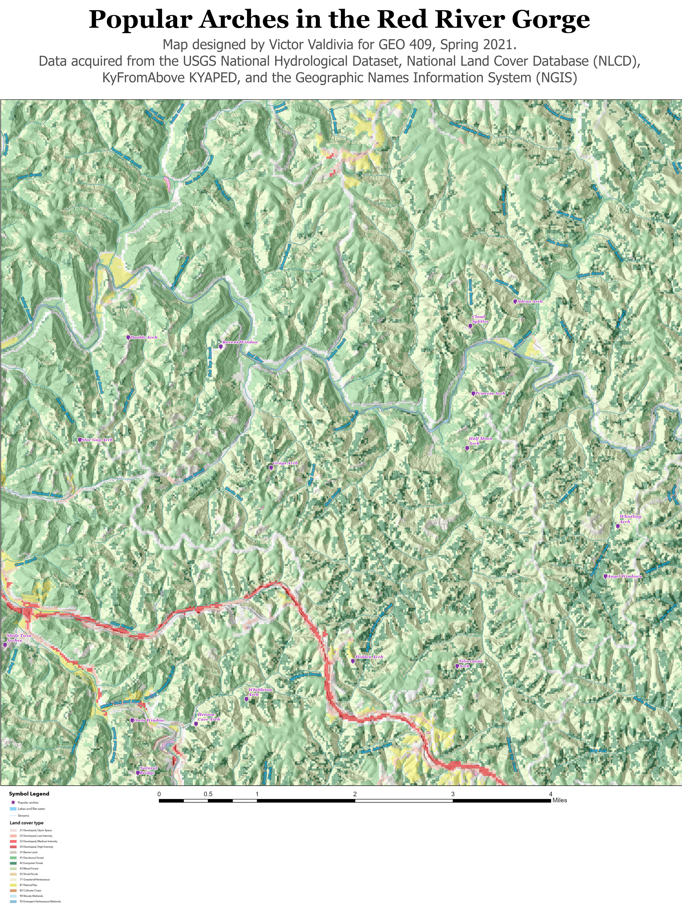
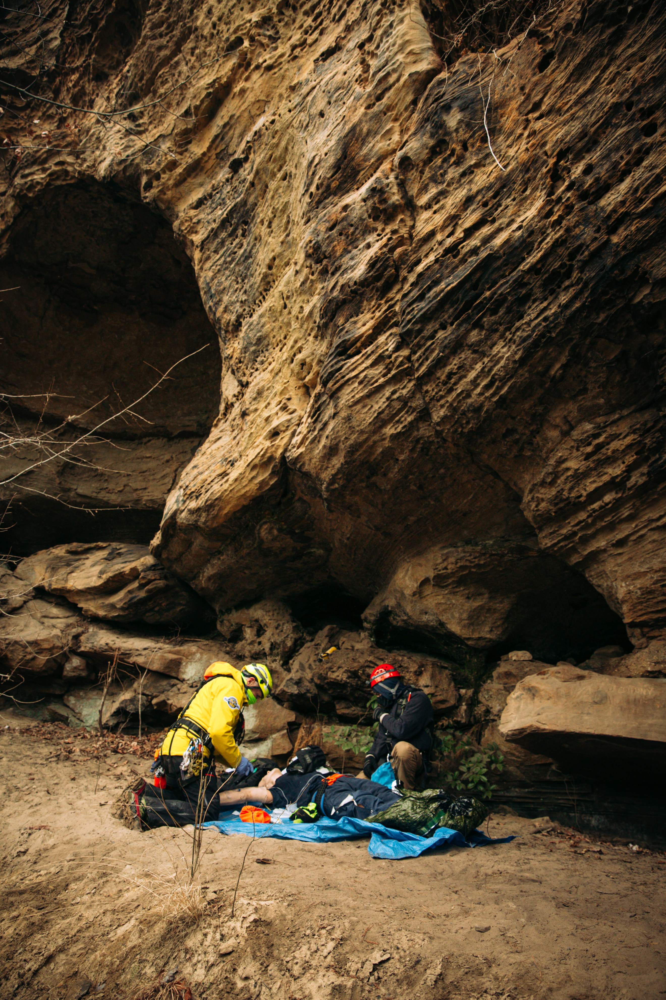
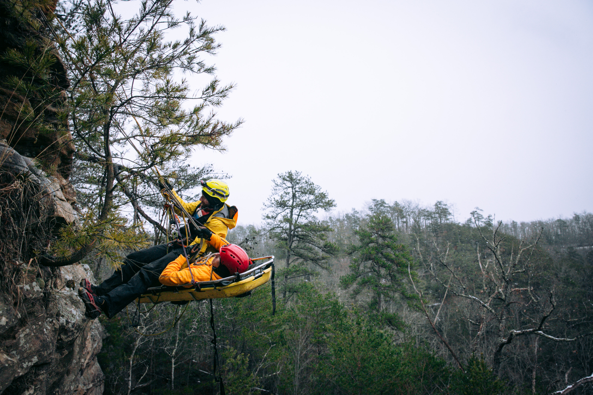
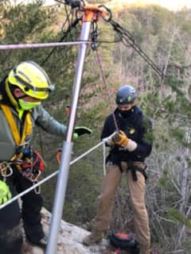

# rrg
Red River Gorge National Geological Area

## A Base map of arches

[Download a GeoPDF of arches](basemap/rrg.pdf)
 Base map of arches

 Image of Victor near Grey's Arch performing high angle medical resuce training. This is at the base of a cliff rendering aid. Image owned by Victor V.

 Image near Grey's Arch performing high angle medical resuce training. This is controlling a basket and patient while on a rope and cliff side. Image owned by Victor V.

 Image of Victor near Grey's Arch performing high angle medical resuce training. This is reppelling down a rock wall. Image owned by Victor V.

 
Image of Victor near Grey's Arch performing high angle medical resuce training. This is Victor about to go over the edge of a cliff. Image owned by Victor V.

https://vtva222.github.io/rrg/
